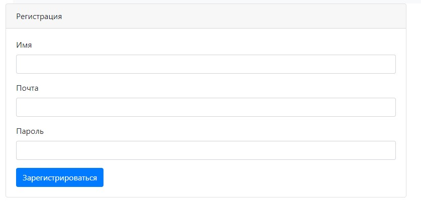

Работа мечты
===

Проект был создан в ознакомительных целях для портфолио.

Функционал проекта:
===

1. Регистрация и авторизация пользователя.
2. Добавление новых вакансий самостоятельно с заполнением таких полей как: название, описание, выбор города.
3. Редактирование вакансии.
4. Вывод на страницу всех вакансий.
5. Добавление новых кандидатов самостоятельно с заполнением таких полей как: имя, описание, фотография.
6. Редактирование кандидата.
7. Вывод на страницу всех кандидатов.
8. Добавление вакансий и постов из переданного XML-файла.
9. Выход из учётной записи.

Какой функционал можно ещё добавить в дальнейшем:
===

1. Редактирование авторизированного пользователя.
2. Добавление новых городов самостоятельно.
3. Добавление городов через переданный XML-файл.
4. Раздельное добавление от имени каждого авторизованного пользователя. (сейчас общая база для всех пользователей)
5. Поиск вакансий и кандидатов по общим признакам - по одному городу, по одному имени, по одной дате создания и т.д.

Первый запуск:
===

1. Создать базу данных с названием jobdream.
2. В файле app.properties в папке resources указать свои username и password для подключения к бд.
3. Выполнить скрипт в базе данных хранящийся в проекте в папке db/scripts/update_01.sql который создаст все нужные для
   проекта таблицы.
4. Запустить метод main из класса Main.
5. Перейти по ссылке которая будет в консоле (http://localhost:8080/index).
6. Так же в проекте присутствует xml-файл с названием PostAndCandidate с помощью которого можно проверить функцию "
   Добавить из xml-файла".

Стек технологий:
===

- Intellij Idea
- Spring Boot/MVC/Data/DAO
- Java Core
- Collection Framework
- Maven
- Tomcat
- PostgreSQL
- Mockito
- Junit test

Скриншоты
===

1. Раздел - Регистрация.

2. Раздел - Войти.

3. Раздел - Вакансии.

4. Раздел - Добавить вакансию.

5. Раздел - Кандидаты.

6. Раздел - Добавить кандидата.

7. Раздел - Добавить из файла.

Контакты
===
telegram: https://t.me/danil31415